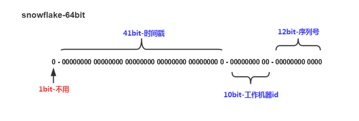

# 分布式 UID 生成器

# 0 使用分布式 UID 的原因与背景
## 0.1 为何要用 分布式 UID 算法？
+ 问题产生的背景
> 现如今越来越多的公司都在用分布式、微服务，那么对应的就会针对不同的服务进行数据库拆分，然后当数据量上来的时候也会进行分表，那么随之而来的就是分表以后id的问题。

> 例如，之前单体项目中一个表中的数据主键id都是自增的，mysql是利用autoincrement来实现自增，而oracle是利用序列来实现的，但是当单表数据量上来以后就要进行水平分表。

> 阿里java开发建议是单表大于500w的时候就要分表，但是具体还是得看业务，如果索引用的号的话，单表千万的数据也是可以的。

> 水平分表就是将一张表的数据分成多张表，那么问题就来了：如果还是按照以前的自增来做主键id，那么就会出现id重复，这个时候就得考虑用什么方案来解决分布式id的问题了。


## 0.2 生成分布式唯一ID(Unique ID , UID)的硬性要求：
> + 全局唯一
>> 不能出现重复的ID号，既然是唯一标识，这是最基本的要求。
> + 趋势递增
>> 在MySQL的InnoDB引擎中使用的是聚集索引，由于多数RDBMS使用BTree的数据结构来存储索引数据。因此在主键的选择上我们应该尽量使用有序的主键保证写入性能。
> + 单调递增
>> 保证下一个ID一定大于上一个ID，例如事务版本号，IM增量消息、排序等特殊需求。
> + 信息安全
>> 如果ID是连续的，恶意扒取用户工作就非常容易做了，直接按照顺序下载指定的URL即可；如果是订单号就更危险了，竞争对手可以直接知道我们一天的单量。所以在一些应用场景下，需要ID无规则。
> + 含时间戳
>> 这样就能够在开发中快速了解分布式ID的生成时间。


## 0.3 解决方案
+ 数据库表
>> 可以在某个库中专门维护一张表，然后每次无论哪个表需要自增id的时候都去查这个表的记录，然后用for update锁表，然后取到的值加一，然后返回以后把再把值记录到表中，但是这个方法适合并发量比较小的项目，因此每次都得锁表。

+ redis
>> 因为redis是单线程的，可以在redis中维护一个键值对，然后哪个表需要直接去redis中取值然后加一，但是这个跟上面一样由于单线程都是对高并发的支持不高，只适合并发量小的项目。

+ UUID(Universally Unique Identifier)
>> + 其标准型式包含32个16进制数字,以连字号分为五段,形式为8-4-4-4-12的32个字符
>> + 示例:550e8400-e29b-41d4-a716-446655440000
>> + 可以使用uuid作为不重复主键id，但是uuid有个问题就是其是无序的字符串。
>> + 优点：UUID性能非常高: 本地生成,没有网络消耗。如果只考虑唯一性UUID是ok的。
>> + 缺点：但是**入数据库的性能较差**。
>>> uuid 导致【**数据库性能变差**】的原因：
>>> + **无序**：无法预测他的生成顺序,不能生成递增有序的数字。首先分布式id 一般都会作为主键, UUID太长,占用存储空间比较大，如果是海量数据库，就需要考虑存储量的问题。
UUID往往是使用字符串存储，查询的效率比较低。传输数据量大，且不可读。
>>> + **索引**, B+树索引的分裂: 分布式id是主键,主键是包含索引的,然后mysql的索引是通过b+树来实现的, 因为UUID数据是无序的，每一次新的UUID数据的插入,为了查询的优化,都会对索引"底层的B+树进行修改,这一点很不好。
>>>> 插入完全无序,不但会导致一些中间节点产生分裂,也会白白创造出很多不饱和的节点,这样大大降低了数据库插入的性能。


+ 分布式 UID ：雪花算法
> 雪花算法是解决分布式id的一个高效的方案，大部分互联网公司都在使用雪花算法，当然还有各个公司自己实现其他的方案。


# 1 Snowflake Algorithm - Twitter
+ 项目官网
> + https://github.com/twitter-archive/snowflake

+ 定义：
> snowflake将long的64位分为了3部分，时间戳、工作机器id和位数分配如下。



> 其中，时间戳部分的时间单位一般为毫秒。也就是说1台工作机器1毫秒可产生4096个id（2的12次方）。
> + **符号位** (1 bit) : 固定为 0
>> 由于 long (64 bit) 基本类型在Java中是带符号的，最高位是符号位，正数是0，负数是1。所以，id 一般是正数，最高位是0
> + **时间戳** (41 bit) : 毫秒级时间戳
>> 41位时间戳不是存储当前时间的时间戳，而是存储时间戳的差值（当前时间戳 - 开始时间戳)得到的值）
>> 这里的的开始时间戳，一般是我们的id生成器开始使用的时间，由我们程序来指定的（如 IdWorker 类的 twepoch / startTime / initialTime 属性）。
>> 41位的时间戳，可以使用69年。 Y = (1L << 41) / (1000L * 60 * 60 * 24 * 365) = 69
> + **机器节点码** (10 bit) : 包括 5位 datacenterId 和 5位 workerId
>> 可部署的机器节点数 = 2^10 = 1024  
> + **序列号** (12 bit) : 每台机器节点产生的序列号
>> 12位序列，毫秒内的计数，12位的计数顺序号支持每个节点每毫秒(同一机器，同一时间戳)产生 4096 个ID序号(2^12 = 4096)

> 加起来刚好64位，为一个Long型。 这样，最大容纳1024台机器节点(2^10)，最多每毫秒每台机器产生4096个id(2^12)。


+ 但是一般我们没有那么多台机器，所以我们也可以使用 53位 来存储id。
> + 为什么要用53位？ 因为我们几乎都是跟web页面打交道，就需要跟js打交道，js支持最大的整型范围为53位，超过这个范围就会丢失精度，53之内可以直接由js读取，超过53位就需要转换成字符串才能保证js处理正确。
> + 53存储的话，32位存储秒级时间戳，5位存储机器码，16位存储序列化，这样每台机器每秒可以生产65536个不重复的id。


+ 存在的优点？
> 整体上按照时间自增排序，并且整个分布式系统内不会产生ID碰撞(由数据中心ID和机器ID作区分)，并且效率较高。
> 经测试，SnowFlake每秒能够产生26万ID左右。 


+ 存在的缺点?
> + 由于雪花算法**严重依赖时间**，所以当发生**服务器时钟回拨**的问题是会导致可能产生重复的id。
> + 当然几乎没有公司会修改服务器时间，修改以后会导致各种问题，公司宁愿新加一台服务器也不愿意修改服务器时间，但是不排除特殊情况。
> + 如何解决**时钟回拨**的问题？
>> 方法1：算法中可通过记录最后一个生成 id 时的时间戳来解决。在每次生成 id 之前，先比较当前服务器时钟是否被回拨，避免生成重复 id。
>> 方法2：可对**序列化的初始值**设置**步长**，每次触发时钟回拨事件，则其初始步长就加1w，可以在下面代码的第85行来实现，将sequence的初始值设置为10000。


``` java

package com.yl.common;

/**
 * Twitter_Snowflake<br>
 * SnowFlake的结构如下(每部分用-分开):<br>
 * 0 - 0000000000 0000000000 0000000000 0000000000 0 - 00000 - 00000 - 000000000000 <br>
 * 1位标识，由于long基本类型在Java中是带符号的，最高位是符号位，正数是0，负数是1，所以id一般是正数，最高位是0<br>
 * 41位时间截(毫秒级)，注意，41位时间截不是存储当前时间的时间截，而是存储时间截的差值（当前时间截 - 开始时间截)
 * 得到的值），这里的的开始时间截，一般是我们的id生成器开始使用的时间，由我们程序来指定的（如下下面程序IdWorker类的startTime属性）。41位的时间截，可以使用69年，年T = (1L << 41) / (1000L * 60 * 60 * 24 * 365) = 69<br>
 * 10位的数据机器位，可以部署在1024个节点，包括5位datacenterId和5位workerId<br>
 * 12位序列，毫秒内的计数，12位的计数顺序号支持每个节点每毫秒(同一机器，同一时间截)产生4096个ID序号<br>
 * 加起来刚好64位，为一个Long型。<br>
 * SnowFlake的优点是，整体上按照时间自增排序，并且整个分布式系统内不会产生ID碰撞(由数据中心ID和机器ID作区分)，并且效率较高，经测试，SnowFlake每秒能够产生26万ID左右。
 */

public class SnowflakeIdWorker {
 
    // ==============================Fields===========================================
    /** 开始时间截 (2020-01-01) */
    private final long twepoch = 1577808000000L;
 
    /** 机器id所占的位数 */
    private final long workerIdBits = 5L;
 
    /** 数据标识id所占的位数 */
    private final long datacenterIdBits = 5L;
 
    /** 支持的最大机器id，结果是31 (这个移位算法可以很快的计算出几位二进制数所能表示的最大十进制数) */
    private final long maxWorkerId = -1L ^ (-1L << workerIdBits);
 
    /** 支持的最大数据标识id，结果是31 */
    private final long maxDatacenterId = -1L ^ (-1L << datacenterIdBits);
 
    /** 序列在id中占的位数 */
    private final long sequenceBits = 12L;
 
    /** 机器ID向左移12位 */
    private final long workerIdShift = sequenceBits;
 
    /** 数据标识id向左移17位(12+5) */
    private final long datacenterIdShift = sequenceBits + workerIdBits;
 
    /** 时间截向左移22位(5+5+12) */
    private final long timestampLeftShift = sequenceBits + workerIdBits + datacenterIdBits;
 
    /** 生成序列的掩码，这里为4095 (0b111111111111=0xfff=4095) */
    private final long sequenceMask = -1L ^ (-1L << sequenceBits);
 
    /** 工作机器ID(0~31) */
    private long workerId;
 
    /** 数据中心ID(0~31) */
    private long datacenterId;
 
    /** 毫秒内序列(0~4095) */
    private long sequence = 0L;
 
    /** 上次生成ID的时间截 */
    private long lastTimestamp = -1L;
 
    //==============================Constructors=====================================
    /**
     * 构造函数
     * @param workerId 工作ID (0~31)
     * @param datacenterId 数据中心ID (0~31)
     */
    public  SnowflakeIdWorker(long workerId, long datacenterId) {
        if (workerId > maxWorkerId || workerId < 0) {
            throw new IllegalArgumentException(String.format("worker Id can't be greater than %d or less than 0", maxWorkerId));
        }
        if (datacenterId > maxDatacenterId || datacenterId < 0) {
            throw new IllegalArgumentException(String.format("datacenter Id can't be greater than %d or less than 0", maxDatacenterId));
        }
        this.workerId = workerId;
        this.datacenterId = datacenterId;
    }
 
    // ==============================Methods==========================================
    /**
     * 获得下一个ID (该方法是线程安全的)
     * @return SnowflakeId
     */
    public synchronized long nextId() {
        long timestamp = timeGen();
 
        //如果当前时间小于上一次ID生成的时间戳，说明系统时钟回退过这个时候应当抛出异常
        if (timestamp < lastTimestamp) {
            throw new RuntimeException(
                    String.format("Clock moved backwards.  Refusing to generate id for %d milliseconds", lastTimestamp - timestamp));
        }
 
        //如果是同一时间生成的，则进行毫秒内序列
        if (lastTimestamp == timestamp) {
            sequence = (sequence + 1) & sequenceMask;
            //毫秒内序列溢出
            if (sequence == 0) {
                //阻塞到下一个毫秒,获得新的时间戳
                timestamp = tilNextMillis(lastTimestamp);
            }
        }
        //时间戳改变，毫秒内序列重置
        else {
            sequence = 0L;
        }
 
        //上次生成ID的时间截
        lastTimestamp = timestamp;
 
        //移位并通过或运算拼到一起组成64位的ID
        return ((timestamp - twepoch) << timestampLeftShift) //
                | (datacenterId << datacenterIdShift) //
                | (workerId << workerIdShift) //
                | sequence;
    }
 
    /**
     * 阻塞到下一个毫秒，直到获得新的时间戳
     * @param lastTimestamp 上次生成ID的时间截
     * @return 当前时间戳
     */
    protected long tilNextMillis(long lastTimestamp) {
        long timestamp = timeGen();
        while (timestamp <= lastTimestamp) {
            timestamp = timeGen();
        }
        return timestamp;
    }
 
    /**
     * 返回以毫秒为单位的当前时间
     * @return 当前时间(毫秒)
     */
    protected long timeGen() {
        return System.currentTimeMillis();
    }
 
    //==============================Test=============================================
    /** 测试 */
    public static void main(String[] args) {
        SnowflakeIdWorker idWorker = new SnowflakeIdWorker(0, 0);
        
        for (int i = 0; i < 100; i++) {
            long id = idWorker.nextId();
            System.out.println(id);
        }
    }
}
```
s


# 2 UidGenerator - Baidu
## 2.1 概述
+ UidGenerator 是什么?
> + UidGenerator 是百度开源的一款由Java实现的、分布式高性能的唯一ID生成器，是基于snowflake模型的一种ID生成器。
> + UidGenerator以【组件形式】工作在应用项目中, 支持自定义workerId位数和初始化策略, 从而适用于 docker 等【虚拟化环境】下实例自动重启、漂移等场景。 
> + 在实现上, UidGenerator 通过借用未来时间来解决 sequence 天然存在的并发限制; 
> + 采用 RingBuffer 来缓存已生成的UID, 并行化UID的生产和消费, 同时对CacheLine补齐，避免了由RingBuffer带来的硬件级「伪共享」问题. 最终单机QPS可达600万。

+ Snowflake 算法 ?


| sign  | delta seconds | worker node id | sequence  |
|-------| ------------- | -------------- |-----------|
| 1 bit | 28 bits       | 22 bits        | 13 bits   |

> 【Snowflake 算法描述】： 指定机器 & 同一时刻 & 某一并发序列，是唯一的。据此可生成一个64 bits的唯一ID（long）。默认采用上图字节分配方式：
> + sign(1bit) : 固定1bit符号标识，即生成的UID为正数。
> + delta seconds (28 bits) : 当前时间，相对于时间基点"2016-05-20"的增量值，单位：秒，最多可支持约8.7年
> + worker id (22 bits) : 机器id，最多可支持约 420w 次机器启动。内置实现为在启动时由数据库分配，默认分配策略为用后即弃，后续可提供复用策略。
> + sequence (13 bits) : 每秒下的并发序列，13 bits可支持每秒8192个并发。

>> 以上参数均可通过 Spring 进行自定义

+ UidGenerator 的优势?
> + 解决了 雪花算法的【时钟回调】问题
> + 使用ringbuffer,无锁进行id的生产与消费,速度非常快
> + 适用于【多线程】,不会有单线程瓶颈

+ uid-generator 的 UID生成器的种类：DefaultUidGenerator
> 提供了两种生成器: 
> + DefaultUidGenerator
> + CachedUidGenerator （如对UID生成性能有要求, 请使用 CachedUidGenerator ）

+ CachedUidGenerator
>+ RingBuffer环形数组，数组每个元素成为一个slot。
>> RingBuffer容量，默认为Snowflake算法中sequence最大值，且为2^N。
>> 可通过boostPower配置进行扩容，以提高RingBuffer 读写吞吐量。
> + Tail指针、Cursor指针用于环形数组上读写slot：
>> + **Tail指针** : 表示Producer生产的最大序号(此序号从0开始，持续递增)。Tail不能超过Cursor，即生产者不能覆盖未消费的slot。当Tail已赶上curosr，此时可通过rejectedPutBufferHandler指定PutRejectPolicy。
>> + **Cursor指针** : 表示Consumer消费到的最小序号(序号序列与Producer序列相同)。Cursor不能超过Tail，即不能消费未生产的slot。当Cursor已赶上tail，此时可通过rejectedTakeBufferHandler指定TakeRejectPolicy


> CachedUidGenerator 采用了双RingBuffer，Uid-RingBuffer用于存储Uid、Flag-RingBuffer用于存储Uid状态(是否可填充、是否可消费)。
> 由于数组元素在内存中是连续分配的，可最大程度利用CPU cache以提升性能。
> 但同时会带来「伪共享」FalseSharing问题，为此在Tail、Cursor指针、Flag-RingBuffer中采用了CacheLine 补齐方式。

> RingBuffer填充时机
> + 初始化预填充
>> RingBuffer初始化时，预先填充满整个RingBuffer.
> + 即时填充
>> Take消费时，即时检查剩余可用slot量(tail - cursor)，如小于设定阈值，则补全空闲slots。阈值可通过paddingFactor来进行配置，请参考Quick Start中CachedUidGenerator配置
> + 周期填充
>> 通过Schedule线程，定时补全空闲slots。可通过scheduleInterval配置，以应用定时填充功能，并指定Schedule时间间隔


+ 依赖组件及版本：
> + Java8 及以上版本
> + MySQL(内置WorkerID分配器, 启动阶段通过DB进行分配; 如自定义实现, 则DB非必选依赖）


+ 项目官网
> + https://github.com/baidu/uid-generator/blob/master/README.zh_cn.md


+ 如何引入依赖?
``` xml
<!-- https://mvnrepository.com/artifact/com.xfvape.uid/uid-generator -->
<dependency>
    <groupId>com.xfvape.uid</groupId>
    <artifactId>uid-generator</artifactId>
    <version>0.0.4-RELEASE</version>
</dependency>
```

## 2.2 Quick Start
这里介绍如何在基于 Spring 的项目中使用UidGenerator, 具体流程如下:

### Step1 安装依赖
+ 先下载Java8, MySQL和Maven

+ 设置环境变量
> maven无须安装, 设置好MAVEN_HOME即可. 可像下述脚本这样设置JAVA_HOME和MAVEN_HOME, 如已设置请忽略.

``` shell
export MAVEN_HOME=/xxx/xxx/software/maven/apache-maven-3.3.9
export PATH=$MAVEN_HOME/bin:$PATH
JAVA_HOME="/Library/Java/JavaVirtualMachines/jdk1.8.0_91.jdk/Contents/Home";
export JAVA_HOME;
```

### Step2 创建表WORKER_NODE
+ 运行sql脚本以导入表WORKER_NODE, 脚本如下:

``` shell
DROP DATABASE IF EXISTS `xxxx`;
CREATE DATABASE `xxxx` ;
use `xxxx`;
DROP TABLE IF EXISTS WORKER_NODE;
CREATE TABLE WORKER_NODE
(
ID BIGINT NOT NULL AUTO_INCREMENT COMMENT 'auto increment id',
HOST_NAME VARCHAR(64) NOT NULL COMMENT 'host name',
PORT VARCHAR(64) NOT NULL COMMENT 'port',
TYPE INT NOT NULL COMMENT 'node type: ACTUAL or CONTAINER',
LAUNCH_DATE DATE NOT NULL COMMENT 'launch date',
MODIFIED TIMESTAMP NOT NULL COMMENT 'modified time',
CREATED TIMESTAMP NOT NULL COMMENT 'created time',
PRIMARY KEY(ID)
)
 COMMENT='DB WorkerID Assigner for UID Generator',ENGINE = INNODB;
```

+ 修改mysql.properties配置中, jdbc.url, jdbc.username和jdbc.password, 确保库地址, 名称, 端口号, 用户名和密码正确.

### Step3 修改 Spring 配置
+ 提供了两种生成器: DefaultUidGenerator、CachedUidGenerator。
+ 如对UID生成性能有要求, 请使用 CachedUidGenerator
> 对应Spring配置分别为: default-uid-spring.xml、cached-uid-spring.xml

+ DefaultUidGenerator 配置
``` xml
<!-- DefaultUidGenerator -->
<bean id="defaultUidGenerator" class="com.baidu.fsg.uid.impl.DefaultUidGenerator" lazy-init="false">
    <property name="workerIdAssigner" ref="disposableWorkerIdAssigner"/>

    <!-- Specified bits & epoch as your demand. No specified the default value will be used -->
    <property name="timeBits" value="29"/>
    <property name="workerBits" value="21"/>
    <property name="seqBits" value="13"/>
    <property name="epochStr" value="2016-09-20"/>
</bean>
 
<!-- 用完即弃的WorkerIdAssigner，依赖DB操作 -->
<bean id="disposableWorkerIdAssigner" class="com.baidu.fsg.uid.worker.DisposableWorkerIdAssigner" />

```

+ CachedUidGenerator 配置
``` xml
<!-- CachedUidGenerator -->
<bean id="cachedUidGenerator" class="com.baidu.fsg.uid.impl.CachedUidGenerator">
    <property name="workerIdAssigner" ref="disposableWorkerIdAssigner" />
 
    <!-- 以下为可选配置, 如未指定将采用默认值 -->
    <!-- Specified bits & epoch as your demand. No specified the default value will be used -->
    <property name="timeBits" value="29"/>
    <property name="workerBits" value="21"/>
    <property name="seqBits" value="13"/>
    <property name="epochStr" value="2016-09-20"/>
 
    <!-- RingBuffer size扩容参数, 可提高UID生成的吞吐量. -->
    <!-- 默认:3， 原bufferSize=8192, 扩容后bufferSize= 8192 << 3 = 65536 -->
    <property name="boostPower" value="3"></property>
 
    <!-- 指定何时向RingBuffer中填充UID, 取值为百分比(0, 100), 默认为50 -->
    <!-- 举例: bufferSize=1024, paddingFactor=50 -> threshold=1024 * 50 / 100 = 512. -->
    <!-- 当环上可用UID数量 < 512时, 将自动对RingBuffer进行填充补全 -->
    <property name="paddingFactor" value="50"></property>
 
    <!-- 另外一种RingBuffer填充时机, 在Schedule线程中, 周期性检查填充 -->
    <!-- 默认:不配置此项, 即不实用Schedule线程. 如需使用, 请指定Schedule线程时间间隔, 单位:秒 -->
    <property name="scheduleInterval" value="60"></property>
 
    <!-- 拒绝策略: 当环已满, 无法继续填充时 -->
    <!-- 默认无需指定, 将丢弃Put操作, 仅日志记录. 如有特殊需求, 请实现RejectedPutBufferHandler接口(支持Lambda表达式) -->
    <property name="rejectedPutBufferHandler" ref="XxxxYourPutRejectPolicy"></property>
 
    <!-- 拒绝策略: 当环已空, 无法继续获取时 -->
    <!-- 默认无需指定, 将记录日志, 并抛出UidGenerateException异常. 如有特殊需求, 请实现RejectedTakeBufferHandler接口(支持Lambda表达式) -->
    <property name="rejectedTakeBufferHandler" ref="XxxxYourTakeRejectPolicy"></property>
 
</bean>
 
<!-- 用完即弃的WorkerIdAssigner, 依赖DB操作 -->
<bean id="disposableWorkerIdAssigner" class="com.baidu.fsg.uid.worker.DisposableWorkerIdAssigner" />
```

+ Mybatis 配置
> mybatis-spring.xml 配置说明如下:
``` xml
<!-- Spring annotation扫描 -->
<context:component-scan base-package="com.baidu.fsg.uid" />

<bean id="sqlSessionFactory" class="org.mybatis.spring.SqlSessionFactoryBean">
    <property name="dataSource" ref="dataSource" />
    <property name="mapperLocations" value="classpath:/META-INF/mybatis/mapper/M_WORKER*.xml" />
</bean>

<!-- 事务相关配置 -->
<tx:annotation-driven transaction-manager="transactionManager" order="1" />

<bean id="transactionManager" class="org.springframework.jdbc.datasource.DataSourceTransactionManager">
	<property name="dataSource" ref="dataSource" />
</bean>

<!-- Mybatis Mapper扫描 -->
<bean class="org.mybatis.spring.mapper.MapperScannerConfigurer">
	<property name="annotationClass" value="org.springframework.stereotype.Repository" />
	<property name="basePackage" value="com.baidu.fsg.uid.worker.dao" />
	<property name="sqlSessionFactoryBeanName" value="sqlSessionFactory" />
</bean>

<!-- 数据源配置 -->
<bean id="dataSource" parent="abstractDataSource">
	<property name="driverClassName" value="${mysql.driver}" />
	<property name="maxActive" value="${jdbc.maxActive}" />
	<property name="url" value="${jdbc.url}" />
	<property name="username" value="${jdbc.username}" />
	<property name="password" value="${jdbc.password}" />
</bean>

<bean id="abstractDataSource" class="com.alibaba.druid.pool.DruidDataSource" destroy-method="close">
	<property name="filters" value="${datasource.filters}" />
	<property name="defaultAutoCommit" value="${datasource.defaultAutoCommit}" />
	<property name="initialSize" value="${datasource.initialSize}" />
	<property name="minIdle" value="${datasource.minIdle}" />
	<property name="maxWait" value="${datasource.maxWait}" />
	<property name="testWhileIdle" value="${datasource.testWhileIdle}" />
	<property name="testOnBorrow" value="${datasource.testOnBorrow}" />
	<property name="testOnReturn" value="${datasource.testOnReturn}" />
	<property name="validationQuery" value="${datasource.validationQuery}" />
	<property name="timeBetweenEvictionRunsMillis" value="${datasource.timeBetweenEvictionRunsMillis}" />
	<property name="minEvictableIdleTimeMillis" value="${datasource.minEvictableIdleTimeMillis}" />
	<property name="logAbandoned" value="${datasource.logAbandoned}" />
	<property name="removeAbandoned" value="${datasource.removeAbandoned}" />
	<property name="removeAbandonedTimeout" value="${datasource.removeAbandonedTimeout}" />
</bean>

<bean id="batchSqlSession" class="org.mybatis.spring.SqlSessionTemplate">
	<constructor-arg index="0" ref="sqlSessionFactory" />
	<constructor-arg index="1" value="BATCH" />
</bean>
```

### Step4 运行示例单测
+ 运行单测CachedUidGeneratorTest, 展示UID生成、解析等功能

``` java 
@Resource
private UidGenerator uidGenerator;

@Test
public void testSerialGenerate() {
    // Generate UID
    long uid = uidGenerator.getUID();

    // Parse UID into [Timestamp, WorkerId, Sequence]
    // {"UID":"180363646902239241","parsed":{    "timestamp":"2017-01-19 12:15:46",    "workerId":"4",    "sequence":"9"        }}
    System.out.println(uidGenerator.parseUID(uid));

}
```

## 2.3 关于UID比特分配的建议
+ 对于**并发数**要求不高、**期望长期使用**的应用, 可增加`timeBits`位数, 减少`seqBits`位数. 
> 例如节点采取用完即弃的WorkerIdAssigner策略, 重启频率为12次/天, 那么配置成{"workerBits":23,"timeBits":31,"seqBits":9}时, 可支持28个节点以整体并发量14400 UID/s的速度持续运行68年.

+ 对于**节点重启频率频繁**、**期望长期使用**的应用, 可增加`workerBits`和`timeBits`位数, 减少seqBits位数.
> 例如节点采取用完即弃的WorkerIdAssigner策略, 重启频率为24*12次/天, 那么配置成{"workerBits":27,"timeBits":30,"seqBits":6}时, 可支持37个节点以整体并发量2400 UID/s的速度持续运行34年.
```shell
2^27 = 37 nodes * (24*12) worker restart count per day * 365 day per year * 34.508 year
  27 = worker bits (工作节点占用的位数)
  37 = worker nodes (工作节点数)
  24 * 12 = 1 worker restart count / day (每个工作节点每天重启的次数)
  365 = day per year (1年的天数)
  34.508 = duration years (能够持续运行的年数)


```

+ 吞吐量测试
> 在MacBook Pro（2.7GHz Intel Core i5, 8G DDR3）上进行了CachedUidGenerator（单实例）的UID吞吐量测试.
> 首先固定住workerBits为任选一个值(如20), 分别统计timeBits变化时(如从25至32, 总时长分别对应1年和136年)的吞吐量, 如下表所示:

| timeBits   | 25        | 26        | 27        | 28        | 29        | 30        | 31        | 32        |
| ---------- | --------- | --------- | --------- | --------- | --------- | --------- | --------- | --------- |
| throughput | 6,831,465 | 7,007,279 | 6,679,625 | 6,499,205 | 6,534,971 | 7,617,440 | 6,186,930 | 6,364,997 |

> 再固定住timeBits为任选一个值(如31), 分别统计workerBits变化时(如从20至29, 总重启次数分别对应1百万和500百万)的吞吐量, 如下表所示:

| workerBits | 20        | 21        | 22        | 23        | 24        | 25        | 26        | 27        | 28        | 29        |
| ---------- | --------- | --------- | --------- | --------- | --------- | --------- | --------- | --------- | --------- | --------- |
| throughput | 6,186,930 | 6,642,727 | 6,581,661 | 6,462,726 | 6,774,609 | 6,414,906 | 6,806,266 | 6,223,617 | 6,438,055 | 6,435,549 |

> 由此可见, 不管如何配置, CachedUidGenerator总能提供600万/s的稳定吞吐量, 只是使用年限会有所减少. 这真的是太棒了.
> 最后, 固定住workerBits和timeBits位数(如23和31), 分别统计不同数目(如1至8,本机CPU核数为4)的UID使用者情况下的吞吐量,

| workerBits | 1         | 2         | 3         | 4         | 5         | 6         | 7         | 8         |
| ---------- | --------- | --------- | --------- | --------- | --------- | --------- | --------- | --------- |
| throughput | 6,462,726 | 6,542,259 | 6,077,717 | 6,377,958 | 7,002,410 | 6,599,113 | 7,360,934 | 6,490,969 |


# X 参考与推荐文献
+ [twitter-archive/snowflake - github](https://github.com/twitter-archive/snowflake)
+ [baidu/uid-generator - github](https://github.com/baidu/uid-generator/blob/master/README.zh_cn.md)
+ [雪花算法和UUID - CSDN](https://blog.csdn.net/m0_53060753/article/details/126577417)
+ [雪花算法以及具体实现 - CSDN](https://blog.csdn.net/xiaoye319/article/details/105988057/)
+ [Spring Boot 集成百度 Uidgenerator分布式ID生成器 - CSDN](https://blog.csdn.net/Y_hanxiong/article/details/128045126)
